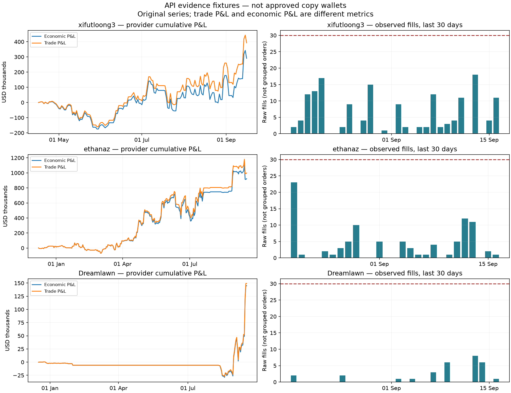

# Wallet data audit and small fixes — 2026-09-17

This is an evidence report, not a second strategy specification. The single current strategy is [WALLET_STRATEGY_LOGIC.md](../WALLET_STRATEGY_LOGIC.md).

## Outcome

- Screened **118 distinct leaderboard wallets** from ALL/MONTH/WEEK, without needing them to trade during the scan.
- Deep-tested **10 wallets**, including quiet, regular, bursty and recently inactive examples.
- Tested more than **500 public JSON requests**, plus accounting ZIP snapshots and Polygon receipt/block reads. These were read-only; no discovery was run against the application database and no orders were placed.
- Completed bounded 30-day cursor walks for trades and activity, and paginated OPEN/REDEEMABLE/CLOSED positions for those 10 wallets. All these final walks reached their terminal cursor. This means complete **within the requested API filters**, not complete blockchain history.
- Reproduced the original 4,000-fill sample using both V1 offsets and V2 cursors: **4,000 matching records, 3,983 transactions, 10.7136 hours**. The wallet is outside the intended activity range, not a suggested copy target.
- Final full backend suite: **2,765 passed, no failures or skips**, including PostgreSQL integration. Listener: **12 passed across 3 suites**.

The raw run began late September 16 UTC, which was September 17 in the user's Europe/London timezone. Accordingly its evidence folder is named `wallet_audit_2026-09-16`.

## Evidence and reproduction

- [Screened cohort](wallet_audit_2026-09-16/screening.json)
- [Computed evidence checks](wallet_audit_2026-09-16/validation.json)
- [Original HFT cross-check](wallet_audit_2026-09-16/hft_crosscheck.json)
- [On-chain duplicate reconciliation](wallet_audit_2026-09-16/duplicate-reconciliation.json)
- [Accounting snapshots](wallet_audit_2026-09-16/accounting-snapshots.json)
- [Market price/book/fee evidence](wallet_audit_2026-09-16/price-evidence.json)
- [Backend test log](backend-tests-2026-09-17.txt), [listener test log](listener-tests-2026-09-17.txt)

Public query URLs, status codes and response hashes are saved in the request manifests alongside each wallet's evidence. No account credentials were used. Wallet-specific JSON files preserve original provider fields and rows, including nulls.

Commands from the repository root:

```powershell
python docs/research/audit_wallet_data.py
python docs/research/summarize_wallet_audit.py docs/research/wallet_audit_2026-09-16
python docs/research/reconcile_duplicate_fills.py
```

The first command performs a new dated live audit; cohorts and values will change. The latter commands inspect the retained September 16 dataset (the receipt script also reads public chain evidence). Supplemental accounting, market, approval and combo queries are recorded with their actual parameters/results. This is not a deterministic replay of a changing upstream service.

## 1. Activity: the target really is 2–30 trades per day

Seventeen wallets initially fit 14–210 raw fills over seven days. Several made most fills in one burst. The initial weekly screen was intentionally broad; daily distributions and a full 30-day walk then exposed those cases.

| Fixture | 7-day fills | 30-day fills | 30-day fills/day | Largest observed UTC-day count | Interpretation |
|---|---:|---:|---:|---:|---|
| xifutloong3 | 48 | 159 | 5.3 | 18 | Fits the raw activity band; performance qualification still needed. |
| ethanaz | 32 | 96 | 3.2 | 23 | Fits the raw activity band; performance qualification still needed. |
| Dreamlawn | 15 | 30 | 1.0 | 8 | Too quiet for core; watchlist research only. |
| ratehikes | 22 | 391 | 13.0 | 169 | Average hides bursts. |
| aghy | 19 | 363 | 12.1 | 139 | Average hides bursts. |
| 11vsldfdsgfkjgos | 19 | 1,343 | 44.8 | 273 | Quiet recent week does not make it a core candidate. |
| totoro3miyazaki | 53 | 462 | 15.4 | 164 | Average hides bursts and concentration. |
| ripley86alien | 74 | 442 | 14.7 | 96 | Average hides bursts. |
| TheyAreTakingTheHobitsToIsengard | 106 | 3,300 | 110.0 | 1,170 | Clearly outside the intended activity range. |

Counts use a fixed rolling cutoff. The first and final UTC dates may be partial; full-day production tests should use completed UTC days. These are raw fills, not independently reconstructed decisions. Both quiet-band fixtures have visibly uneven P&L histories; neither was certified as consistent or selected for copying.

The original very-high-frequency fixture produced the same result through two API versions, but those APIs are not independent indexers. The finding establishes that the original result was reproducible and wallet-scoped; it does not establish the exact number of human trading decisions. Thousands of transactions in that interval remain incompatible with the intended core behavior.

## 2. Available data and limitations

| Capability tested | What was returned | Important interpretation |
|---|---|---|
| Gamma public profile | Address/profile identity, display metadata where supplied | Images and names can be missing. Names are not identity keys. |
| ALL/WEEK/MONTH leaderboards | Wallet addresses, ranks, volume, period P&L | Find inactive-at-scan wallets. Period definitions and source times must not be silently mixed. |
| V2 user stats | Distinct-market `trades`, biggest win, join date, views, detailed all-time P&L object | `trades` is not fill count. `all_time_pnl.trade_count` is a different field. |
| V2 trades | Maker/taker-inclusive history, side, price, size, token, market, timestamp, transaction | Cursor traversal worked. API minimum-size defaults can still omit microscopic activity. |
| V2 activity | Trades, redemptions, maker/taker rebates, rewards; conversions in one fixture | Do not reconstruct economics from BUY/SELL alone. Other activity types require additional fixtures. |
| V2 positions | Quantity, entry cost/fees, realized/unrealized/total P&L, current value, lifecycle flags | OPEN and REDEEMABLE overlap. Redeemable was observed even on zero-priced losing inventory: never infer a win from that flag. |
| V2 user P&L | 1w/1m/all curves; multiple P&L components; source block and resolution | Actual source observations can be daily even on an hourly output grid. |
| V2 volume | Volume metrics and fill count over time bounds | Day-rounded volume windows need not match second-bounded trade queries exactly. |
| V2 value | Marked position value | Does not by itself include idle wallet cash. |
| Accounting ZIP snapshot | Position quantities/marks, cashBalance, positionsValue, equity, valuation time | Potential current-bankroll source, subject to collateral/proxy and valuation verification. |
| V2 approvals | Token/spender approval state | Useful integration context; not a quality or profitability signal. |
| Combo activity/positions | Valid empty cursor responses for one sampled wallet | Endpoint availability confirmed, not nonempty combo correctness. |
| V2 status | Provider timestamp, mechanism freshness, block-lag diagnostics | Overall freshness does not prove a particular wallet's history is complete. |
| Token price history | 15 historical points across two cursor pages; point-in-time price at/before a trade | Useful for valuation. Not an order book or proof of historical executable liquidity. |
| Current book/market/fees | Five-share minimum, tick size, depth, market fee metadata and fee-rate response | Do not interpret fee-rate fields or minimum sizes as universal flat dollar rules. |
| Polygon receipts | Actual signed-order hashes, contract, log index and quantities | Resolves identities the public trade rows alone cannot distinguish. |

Observed but not solved by these reads: full historical cash/deposit/withdrawal ledger (null fields occurred), off-platform holdings/hedges, source strategy intent, full historical order-book depth, cancelled/unfilled orders of other users, and future copy execution quality. Public reads do not grant access to someone else's authenticated order account.

Primary API references: [cursor/trade contract](https://docs.polymarket.com/api-reference/feeds/list-trades), [P&L series](https://docs.polymarket.com/api-reference/wallet/get-a-users-pnl-series), [accounting snapshot](https://docs.polymarket.com/api-reference/misc/download-an-accounting-snapshot-zip-of-csvs), [token price history](https://docs.polymarket.com/api-reference/markets/get-a-tokens-price-history). Observations above come from the saved live responses rather than assumed documentation examples.

## 3. Cursor and accounting checks

Saved evidence validation produced **118 passing checks and two false uniqueness assumptions** out of 120 checks. Successful checks covered wallet scope, date bounds, ordering, terminal cursors, position identity, curve timestamp ordering and two P&L component identities within one cent.

The two uniqueness failures were investigated instead of deleting rows to force a pass. Across those wallets, three pairs of identical API rows matched **six distinct on-chain OrderFilled logs**, with different signed-order hashes and log indexes. Receipt wallet, quantity, price, block hash and timestamp were checked. All three pairs were explained. The general rule is consequently unchanged: use canonical event identity, not transaction/price/size deduplication. The retained validation file deliberately still records that the original uniqueness assumption was false.

For every deep-tested wallet, the multiset of 30-day activity TRADE rows matched the 30-day trades endpoint, including repeated identical fills. This is useful cross-endpoint agreement, not independent-chain certification for every row.

Cursor failure injection covers partial outages, repeated pages, repeated cursors, empty intermediate pages, inconsistent terminal pagination, filter preservation and budget truncation. One intentionally invalid live cursor returned HTTP 400 as expected. No throttling attack was used to provoke rate limits; existing mocked retry tests cover bounded 429 behavior.

Accounting component checks confirm internal provider identities such as position P&L = realized + unrealized and economic P&L = position P&L + wallet income. They do not independently prove every cost basis or fee. A 30-day volume counter and 30-day trade count can differ because the volume endpoint rounds to UTC days; this must not be “fixed” by inventing missing fills.

## 4. Graphs and faithful copying



[SVG export](wallet_audit_2026-09-16/wallet-curves.svg). These graphs use the original provider values. They are not rescaled to match a leaderboard number. The two P&L metrics visibly differ; they must retain their labels. Line interpolation between returned points does not imply additional observations. Source blocks/fidelity are preserved in the underlying data.

The accounting snapshots returned approximately **$637,458 cash** for xifutloong3 and **$911,433 cash** for ethanaz, with zero marked position value at those snapshot times. In contrast, `/v2/value` returned zero for both. Treating that zero as total bankroll would be wrong. These are current provider balances, not a reconstructed historical bankroll or a claim about all assets owned by the person.

The updated strategy prefers a stable proportional share multiplier and preserves relative allocations. Limits determine whether the whole strategy is feasible for a given account. Selective conviction resizing is not the default. Historical bankroll changes, initial open inventory, fees, delays, minimum orders and hidden hedges are still explicit replication limitations.

## 5. Small application fixes completed

1. Leaderboards now use 50-row pages without skipped 50-rank blocks.
2. Trade history explicitly includes maker fills and pins the end timestamp; activity pins its end timestamp too.
3. No fabricated trade-multiple or P&L-multiple wallet volume estimates.
4. Missing ALL P&L cannot fall back to MONTH P&L or current-position cashPnl.
5. New wallet persistence is gated by verified finite P&L >= $50,000; unknown/low values never reach deep evaluation as newly stored candidates. Existing wallet history is retained.
6. The $50,000 comparison preserves provider precision instead of rounding a value just below the threshold upward.
7. Closed positions use the documented uppercase sort value. Current positions explicitly include dust instead of applying the default size threshold.
8. V2 user-stats reads handle null/mismatched identity correctly; documentation distinguishes markets from fills.
9. PostgreSQL integration testing exposed a real summary defect: unknown current marks were replaced with entry prices and flat P&L. The summary now preserves unknown total P&L/balance and exposes only its known subtotal. The existing integration regression and related valuation tests pass after the correction.

New regression tests use synthetic providers and isolated in-memory databases. No production database, user backups, allocations or frontend were edited. The existing scorer has not been replaced by the proposed 2–30/day decision-based evaluator; that belongs to the agreed logic implementation phase, after grouping/coverage semantics are settled.

## 6. Test environment and remaining strategy evidence

Final verification used the local Python 3.12.10 virtual environment, Polymarket SDK 0.10.0, and a fresh database named `baleen_wallet_audit_20260917_9c38` on the existing WSL test PostgreSQL server at localhost:55432. The application database was never substituted. The task-specific database was dropped after the passing run; the pre-existing test server was retained. [Environment versions](test-environment.json) are saved. Initial default-Python/dependency issues were resolved before the final run, and there are no remaining skipped tests in that run.

The full backend and listener suites completed successfully. No frontend source changed, so no frontend build was required for these fixes; the corrected backend summary intentionally reports unknown values where the old fallback invented a complete balance.

Still required before large strategy changes can be called validated: independent full-ledger reconciliation for candidate wallets; a reliable current/historical strategy-capital denominator; canonical grouping across all source versions; enough independent outcomes; walk-forward selection/copy replay with historical execution data; and future shadow observation. Those cannot be honestly replaced by successful GET requests or a profitable-looking chart. The API discovery/testing phase is substantially complete for the endpoints above; strategy profitability and all possible wallet/provider cases are not established.

## 7. Cleanup

- Kept `docs/WALLET_STRATEGY_LOGIC.md` as the sole current strategy specification and preserved the original request unchanged.
- Moved the old master spec, PROJECT, AUDIT and TEST_INFRA into [the historical archive](../archive/legacy/README.md), retaining unique historical details and marking them superseded.
- Removed duplicate stale `TEST_READY.md` and obsolete `backend/scratch_update_scanner.py`, which rewrote the scanner from an old embedded implementation.
- Retained operational/live-readiness documents, tests, user data/backups, local databases and design assets. These were not proven useless.

No deployment or commit was made.
